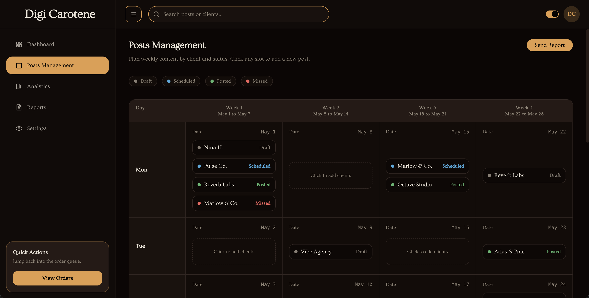

# Digi Carotene — Service Management

Service management app for **Digi Carotene**, a digital marketing agency. Staff manage clients, projects, posts, and team assignments in the **Staff Portal**; registered brands track their content schedule in the **Client Portal**.



## What it does

Digi Carotene runs client work through a clear hierarchy: **clients → projects → posts**. Staff schedule and publish social content, assign managers and team members to projects, and review analytics and reports. Clients get a read-only view of their brand’s posts and account details.

## Key features

### Public site
- Marketing landing page, services, about, and contact
- Sign-in entry points for staff and client portals

### Staff Portal (`/staff-portal`)
- **Dashboard** — team workload, publishing performance, posts needing attention
- **Team** — agency specialists (executives, managers, staff) and project history
- **Clients** — company registry and contact details
- **Projects** — social profile URLs, manager, and team assignments per client engagement
- **Posts** — month calendar with status-aware scheduling (`Not posted`, `Scheduled`, `Posted`)
- **Analytics & Reports** — agency-wide and client activity views

### Client Portal (`/client-portal`)
- Dashboard, posts list, and account for the signed-in brand

---

## Tech stack

- **Frontend**: React, React Router v7, Tailwind CSS, Shadcn UI
- **Charts**: Recharts
- **Backend**: Supabase (PostgreSQL, RLS)
- **Build**: Bun / Vite

---

## Getting started

### 1. Install dependencies

```bash
bun install
```

### 2. Set up Supabase

Run in Supabase **SQL Editor**:

- **New project:** [`scripts/migrations/001_initial_schema.sql`](scripts/migrations/001_initial_schema.sql)
- **Existing project:** apply missing files from [`scripts/migrations/`](scripts/migrations/)

See [docs/database.md](docs/database.md) and [docs/README.md](docs/README.md).

### 3. Development

```bash
bun run dev
```

### 4. Production build

```bash
bun run build
```

---

## Project structure

```
src/
  app/              Router and app shell
  features/         Feature modules (staff-portal, client-portal, public, …)
  shared/           Cross-feature UI, layouts, utils
docs/               Schema, DTOs, and feature docs
scripts/migrations/ Numbered SQL migrations
```
